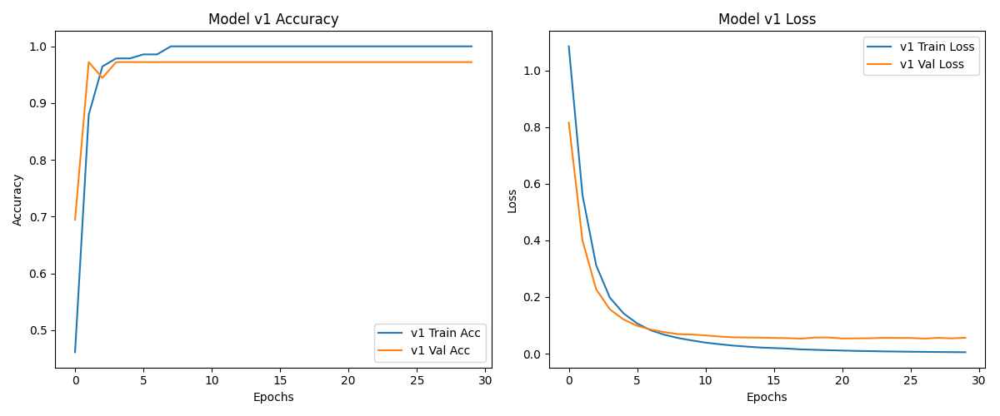
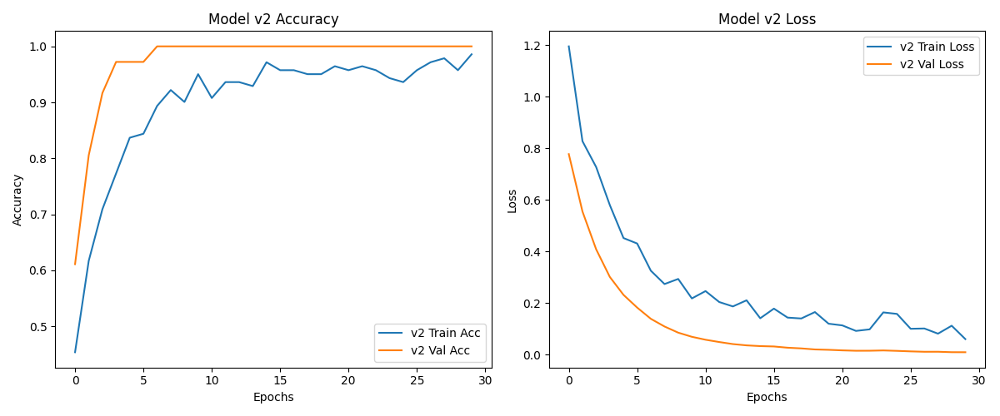

### O treningu modelu v1:
Jak widzimy na wykresach, trening modelu v1 jest bardziej stabilny niż modelu v2, choć accuracy oraz loss są podobne po epoce 15. Powodem może być overfitting (daliśmy za dużo parametrów/neuronów), a gładkość może wynikać z użycia dobrej inicjalizacji He do funkcji aktywacji ReLU.

### O treningu modelu v2:
W modelu v2 widzimy znacznie większą niestabilność w uczeniu, choć accuracy stale rośnie, a loss stale maleje, co wskazuje na możliwość dalszego trenowania na większej liczbie epok. Niestabilność może być spowodowana tym, że daliśmy modelowi za dużo swobody lub użyliśmy zbyt silnego regularyzatora, czyli Dropout(0.3) dwa razy, który usuwa losowo 30% neuronów z ostatniej warstwy. Nie wydaje nam się, że aktywacja ELU może być powodem niestabilności, ale mniejsza liczba neuronów razem z regularyzatorem prawdopodobnie sprawia, że model jest zbyt słaby, by uczyć się stabilnie.

#### Wykres modelu v1:

#### Wykres modelu v2:
